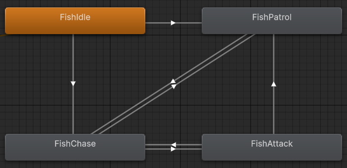

# 🌀WHIRLPOOL🌀

## 🌊Overview

Whirlpool is a 3D Action First-Person Shooter where the player controls a character in an underwater world where they have to fight their way through levels filled with fishy foes.

## 🌊Core Gameplay
Players dive through a series of flooded temple chambers while battling sea creatures.   

Combat: Use a variety of ranged weapons to defeat enemies, from basic harpoons to high-tech underwater weapons.  

Progression: Collect key items or defeat specific enemy waves to unlock sealed areas and advance through the temple.  

Endgame: When the boss is defeated, the player either triggers the game ending or unlocks a final relic that ends the game on interaction. The completion time is recorded and compared to the best times of players.  

## 🌊Game Type

Action First-Person Shooter.

## 🌊Player Setup

In single player, you control the main character in a first-person view.

In online multiplayer, each player controls their own character and they fight amongst themselves.

## 🌊AI Design
The main entities with AI in this game would be the game’s enemies. 

There will be two major types of enemies: a melee enemy which will try and rush the player when they get too close, and an enemy with a ranged attack which will periodically shoot at the player and attempt to dodge their attacks. 

Additionally, there will be a boss that will switch between both attacking styles randomly in order to disorient the player and provide a more challenging encounter.

Any additional enemy AIs we add will all be variations on these three concepts.

## 🌊Scripted Events

Certain areas will be blocked off via collectable keys or enemy arenas, which would force the player to progress through specific segments before gaining additional access in the environment.

The end of the level will have a major boss, which, when defeated, which either immediately end the game or unlock access to an object which ends the game when interacted with.

Upon completing the game, the player’s playtime is displayed and, if it’s fast enough, saved as their “best time.”

## 🌊Environment

The environment would be meant to resemble an underwater temple, which is segmented off into different rooms and areas.

There will be an attempt to create the models necessary to build the environment ourselves, but for more complicated objects (and enemies) free-to-use assets or 2D sprites mapped to a 3D object will be employed instead.

## 🌊Physics Scope

The physics, at least in concept, will have somewhat of a floaty feeling to mimic the sensation of being underwater. To what extent this will play out is currently undecided, as the game still needs to be responsive and easy to move around in.

This is more of a flourish than a required element, however. If there is not time to implement this in a way that feels nice, more traditional FPS physics will be used instead.

## 🌊FSM Scope

The scope of the Finite State Machines are as follows:

Enemies will switch between three states. “Passive,” where they largely stand in place or patrol a set area; “Hostile”, where they attempt to attack the player; and “Dead”, where the enemy is replaced by an unmoving and harmless corpse sprite. The major boss entity will largely function identically to the standard enemy FSM as well.

Doors will have an “open”, “locked”, and “closed” state. Most doors start as “closed” by default, and can be opened either by the player directly interacting with the door itself or by the player passing a certain location on the map. “Locked” doors will require you to find a key somewhere on a map or defeat certain enemies in order to open the door.

Items will have a “not collected” and “collected” state in order to prevent the player from infinitely adding them to their inventory. Items such as door keys will have unique “collected” states which will allow you to open relevant “locked” doors, but otherwise this state is largely similar to the normal collected state mechanically speaking.

## 🌊Systems and Mechanics

The major systems at play are as follows:

Attacking with your (presumably ranged) weapon, and the collision of those attacks.

Enemies that can move, attack and deal damage at specific (or random) intervals, and be killed by the player.

The collection of items that can either benefit the player (such as healing their health) or unlock access to additional areas.

Areas of the map that gate progression behind beating a specific subset of the game’s total enemies.

The recording of the player’s completion time, as well as a points system based on items collected and total enemies beaten.

## 🌊Controls (proposed)
W A S D              move  
Mouse                look  
Left mouse button    shoot  
Space                jump  
Shift                sprint  
E                    interact  
Mousewheel           change weapons  
ESC                  pause to menu  

## 🌊Project Setup/Team Plan
Unity (6.0)

C# Scripts

Animation controllers for playable character and enemies.

Physics materials and layers configured in Project Settings.

GitHub repository with regular commits and meaningful messages.

Readme and in game debug UI showing FPS, state names, and safety meter for assessment.

Weekly meetings to discuss the project and assign tasks.

## 🌊Finite State Machine Implementation
The finite state machine for the standard fish enemy currently contains four states. These states are FishIdle, FishPatrol, FishAttack, and FishChase.

- While in the FishIdle state, the enemy does not move in any way. This is largely a transitory state, as the enemy will transition to either FishPatrol or FishChase almost immediately.

- While in the FishPatrol state, the enemy will move on a set path until the player gets close enough to activate the FishChase state.

- While in the FishChase state, the enemy will attempt to get as close as possible until the player is able to be damaged by its attack. Once it is in range, the enemy will enter the FishAttacks state. If the player is too far away from the enemy, it will re-enter the FishPatrol state.
 
- While in the FishAttacks state, the enemy stays in place and deals damage if the player is too close. If the player gets further away from the enemy, it will re-enter FishChase or FishPatrol depending on how large the distance between the enemy and the player is.

  An additional "FishDead" state will be implemented later on, which will prevent the enemy from moving or harming the player when it takes enough damage. As it currently is not implemented, there are no transitions that will let you enter this state.

Youtube video showcasing the fish enemy in action: https://www.youtube.com/watch?v=MsQNYEW6u8U

## 🌊Descision Tree and Pathfinding
